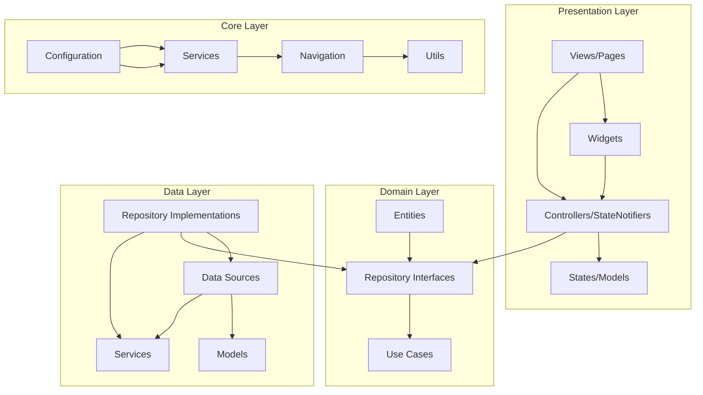
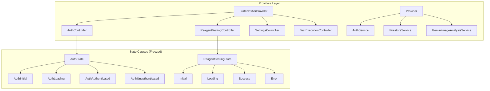
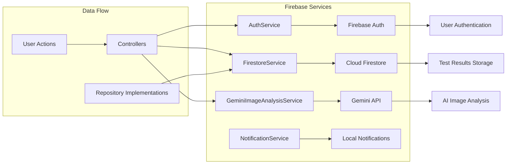
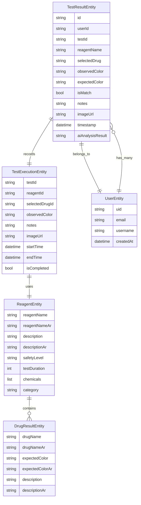
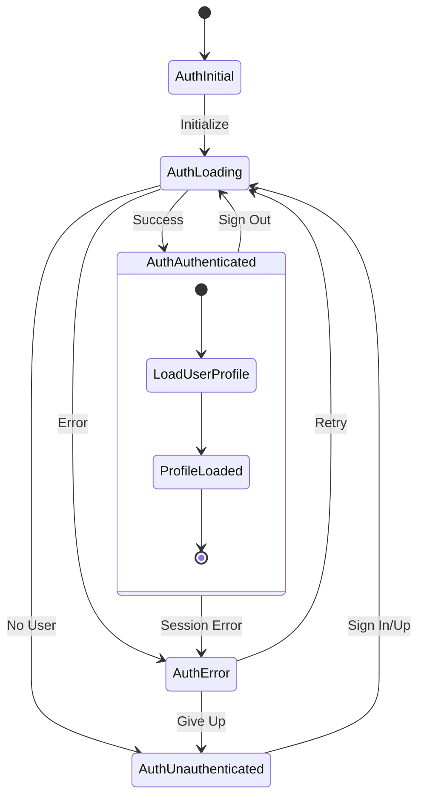
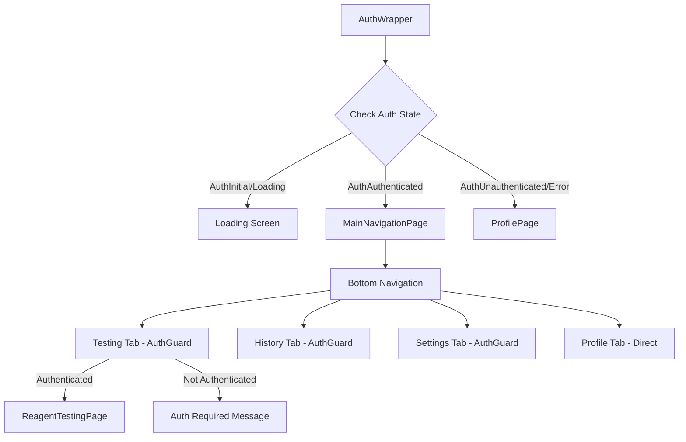
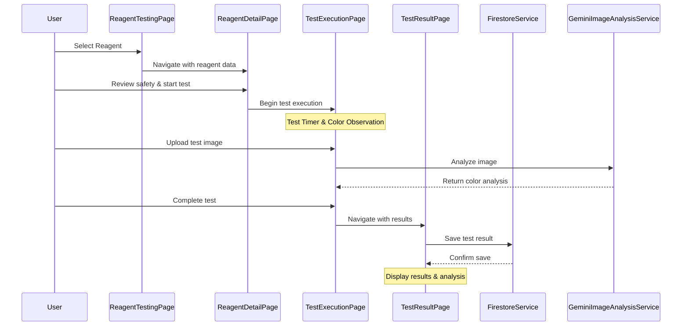
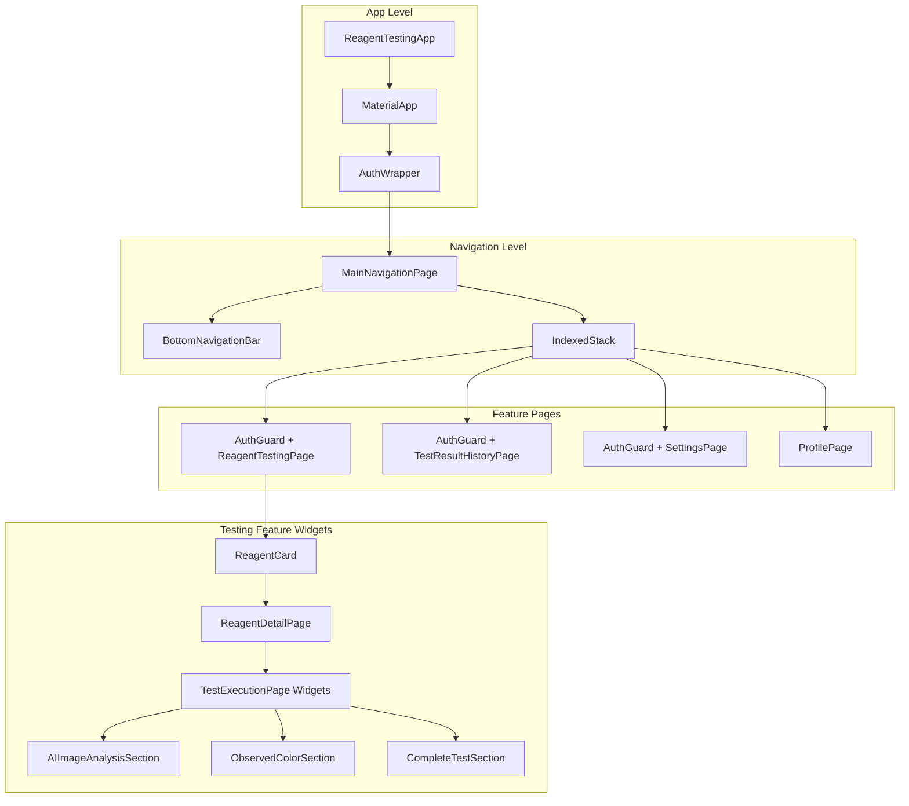

# Reagent Testing App - Comprehensive Architecture & Structure

## 📋 Executive Summary

This Flutter application is a **professional drug testing solution** using chemical reagents, built with **Clean Architecture + MVVM** pattern. The app features multilingual support (English/Arabic), Firebase integration, AI-powered image analysis, and comprehensive testing workflow management.

### Key Technical Features
- 🏗️ **Clean Architecture** with feature-based modular structure
- 🔄 **Riverpod State Management** with reactive UI updates
- 🔥 **Firebase Integration** (Auth, Firestore, Storage)
- 🤖 **AI Image Analysis** using Google Gemini API
- 🌐 **Internationalization** (English/Arabic with RTL support)
- 📱 **Cross-Platform** (iOS, Android, Web)
- 🔒 **Authentication Guards** for secure access
- 💾 **Local Data Persistence** with SharedPreferences

---

## 🏗️ Architecture Overview

### Clean Architecture Layers



---

## 📁 Complete Project Structure

```
reagent_colors_test/
├── lib/
│   ├── main.dart                          # App entry point with Firebase init
│   ├── firebase_options.dart              # Firebase configuration
│   │
│   ├── core/                             # Shared core functionality
│   │   ├── config/
│   │   │   ├── get_it_config.dart        # Dependency injection (GetIt)
│   │   │   └── api_keys.dart             # API keys configuration
│   │   ├── navigation/
│   │   │   ├── auth_wrapper.dart         # Authentication routing wrapper
│   │   │   └── main_navigation_page.dart # Bottom navigation with auth guards
│   │   ├── services/
│   │   │   ├── auth_service.dart         # Firebase Authentication service
│   │   │   ├── firestore_service.dart    # Firestore CRUD operations
│   │   │   ├── gemini_image_analysis_service.dart # AI analysis service
│   │   │   └── notification_service.dart  # In-app notifications
│   │   ├── utils/
│   │   │   ├── localization_helper.dart  # Language utilities
│   │   │   └── logger.dart               # Debug logging
│   │   └── widgets/
│   │       ├── auth_guard.dart           # Route protection widget
│   │       └── notification_demo_widget.dart
│   │
│   ├── features/                         # Feature-based modules
│   │   ├── auth/                         # Authentication feature
│   │   │   ├── data/
│   │   │   │   └── models/
│   │   │   │       └── user_model.dart   # Firebase User data model
│   │   │   ├── domain/
│   │   │   │   └── entities/
│   │   │   │       └── user_entity.dart  # Business logic user entity
│   │   │   └── presentation/
│   │   │       ├── controllers/
│   │   │       │   └── auth_controller.dart # Auth state management
│   │   │       ├── states/
│   │   │       │   └── auth_state.dart   # Auth UI states (freezed)
│   │   │       └── views/
│   │   │           ├── auth_debug_page.dart
│   │   │           └── firestore_debug_page.dart
│   │   │
│   │   ├── profile/                      # User profile feature
│   │   │   └── presentation/
│   │   │       └── views/
│   │   │           └── profile_page.dart # Profile UI with auth integration
│   │   │
│   │   ├── reagent_testing/              # Main testing feature
│   │   │   ├── data/
│   │   │   │   ├── models/
│   │   │   │   │   ├── drug_result_model.dart
│   │   │   │   │   ├── reagent_model.dart
│   │   │   │   │   ├── test_result_model.dart
│   │   │   │   │   └── gemini_analysis_models.dart
│   │   │   │   ├── repositories/
│   │   │   │   │   ├── reagent_testing_repository_impl.dart
│   │   │   │   │   └── test_result_history_repository.dart
│   │   │   │   └── services/
│   │   │   │       ├── json_data_service.dart
│   │   │   │       ├── remote_config_service.dart
│   │   │   │       └── safety_instructions_service.dart
│   │   │   ├── domain/
│   │   │   │   ├── entities/
│   │   │   │   │   ├── reagent_entity.dart
│   │   │   │   │   ├── drug_result_entity.dart
│   │   │   │   │   ├── test_execution_entity.dart
│   │   │   │   │   └── test_result_entity.dart
│   │   │   │   └── repositories/
│   │   │   │       └── reagent_testing_repository.dart
│   │   │   └── presentation/
│   │   │       ├── controllers/
│   │   │       │   ├── reagent_testing_controller.dart
│   │   │       │   ├── reagent_detail_controller.dart
│   │   │       │   ├── test_execution_controller.dart
│   │   │       │   ├── test_result_controller.dart
│   │   │       │   └── test_result_history_controller.dart
│   │   │       ├── providers/
│   │   │       │   └── reagent_testing_providers.dart
│   │   │       ├── states/
│   │   │       │   ├── reagent_testing_state.dart
│   │   │       │   ├── test_execution_state.dart
│   │   │       │   ├── test_result_state.dart
│   │   │       │   └── test_result_history_state.dart
│   │   │       ├── views/
│   │   │       │   ├── reagent_testing_page.dart
│   │   │       │   ├── reagent_detail_page.dart
│   │   │       │   ├── test_execution_page.dart
│   │   │       │   ├── test_result_page.dart
│   │   │       │   └── test_result_history_page.dart
│   │   │       └── widgets/
│   │   │           ├── reagent_card.dart
│   │   │           ├── reagent_detail/
│   │   │           │   ├── reagent_header_card.dart
│   │   │           │   ├── chemical_components_section.dart
│   │   │           │   ├── safety_acknowledgment_section.dart
│   │   │           │   ├── drug_results_section.dart
│   │   │           │   ├── safety_instructions_section.dart
│   │   │           │   └── test_preparation_section.dart
│   │   │           └── test_execution/
│   │   │               ├── ai_image_analysis_section.dart
│   │   │               ├── complete_test_section.dart
│   │   │               ├── observed_color_section.dart
│   │   │               ├── reagent_information_section.dart
│   │   │               ├── test_notes_section.dart
│   │   │               ├── test_timer_section.dart
│   │   │               └── upload_image_section.dart
│   │   │
│   │   └── settings/                     # App settings feature
│   │       ├── data/
│   │       │   ├── models/
│   │       │   │   └── settings_model.dart
│   │       │   ├── repositories/
│   │       │   │   └── settings_repository_impl.dart
│   │       │   └── services/
│   │       │       └── shared_preferences_service.dart
│   │       ├── domain/
│   │       │   ├── entities/
│   │       │   │   └── settings_entity.dart
│   │       │   └── repositories/
│   │       │       └── settings_repository.dart
│   │       └── presentation/
│   │           ├── controllers/
│   │           │   └── settings_controller.dart
│   │           ├── providers/
│   │           │   └── settings_providers.dart
│   │           ├── states/
│   │           │   └── settings_state.dart
│   │           ├── views/
│   │           │   └── settings_page.dart
│   │           └── widgets/
│   │               ├── settings_section.dart
│   │               └── settings_tile.dart
│   │
│   └── l10n/                            # Internationalization
│       ├── app_en.arb                   # English translations
│       ├── app_ar.arb                   # Arabic translations
│       ├── app_localizations.dart       # Generated localizations
│       ├── app_localizations_en.dart    # English localizations
│       └── app_localizations_ar.dart    # Arabic localizations
│
├── assets/                              # Static assets
│   ├── data/
│   │   └── reagents/                    # Reagent test data (JSON)
│   │       ├── marquis_reagent.json
│   │       ├── ehrlich_reagent.json
│   │       ├── safety_instructions.json
│   │       └── [other reagent files]
│   └── images/
│       └── google_logo.png
│
├── firebase_options.dart                # Firebase SDK configuration
├── firebase.json                       # Firebase project configuration
├── firestore.rules                     # Firestore security rules
├── firestore.indexes.json              # Firestore database indexes
│
└── [platform directories]              # iOS, Android, Web, etc.
```

---

## 🔄 State Management Architecture

### Riverpod Provider Structure



---

## 🔥 Firebase Integration Architecture

### Service Layer Design



---

## 🎯 Core Business Entities

### Domain Model Relationships



---

## 🔒 Authentication Flow

### Auth State Management



### AuthWrapper Navigation Logic



---

## 🧪 Testing Workflow Architecture

### Test Execution Process



---

## 📱 UI Component Hierarchy

### Main Page Structure



---

## 🌐 Internationalization Architecture

### Localization Structure

```mermaid
graph LR
    subgraph "Localization Sources"
        A[app_en.arb] --> C[AppLocalizations]
        B[app_ar.arb] --> C
    end
    
    subgraph "Generated Files"
        C --> D[app_localizations.dart]
        C --> E[app_localizations_en.dart]
        C --> F[app_localizations_ar.dart]
    end
    
    subgraph "Application Usage"
        G[Widgets] --> H[AppLocalizations.of(context)]
        H --> D
        I[JSON Data] --> J[Language-specific fields]
        J --> K[reagentName vs reagentNameAr]
    end
```

---

## 🛠️ Development Guidelines

### Code Organization Principles

1. **Feature-First Structure**: Each feature contains its complete architecture
2. **Clean Architecture**: Strict layer separation with dependency inversion
3. **Riverpod State Management**: Reactive programming with immutable states
4. **Internationalization**: All text content supports EN/AR with RTL
5. **Authentication Guards**: Secure access to protected features
6. **Error Handling**: Comprehensive error states and user feedback
7. **Firebase Integration**: Scalable cloud backend with offline support

### Key Design Patterns Used

- **Repository Pattern**: Data access abstraction
- **State Management**: Riverpod with StateNotifier
- **Dependency Injection**: GetIt for service location
- **Observer Pattern**: Firebase stream listeners
- **Factory Pattern**: Model creation and transformation
- **Guard Pattern**: Authentication and route protection

---

## 📊 Performance Optimizations

### State Management Optimizations
- **Selective rebuilds** with Consumer widgets
- **Provider scope** optimization
- **Immutable state** classes with Freezed
- **Memory management** in image processing

### Firebase Optimizations
- **Connection pooling** for Firestore
- **Offline data persistence**
- **Batch operations** for multiple writes
- **Index optimization** for queries

---

## 🔮 Extensibility Points

### Future Enhancement Areas
1. **Additional Reagent Types**: Easy addition via JSON configuration
2. **Advanced AI Analysis**: Enhanced image processing capabilities
3. **Export Features**: PDF/CSV result exports
4. **Social Features**: Team collaboration and result sharing
5. **Analytics**: Usage tracking and testing statistics
6. **Offline Mode**: Enhanced offline testing capabilities

This architecture provides a solid foundation for a professional-grade reagent testing application with excellent maintainability, scalability, and user experience. 